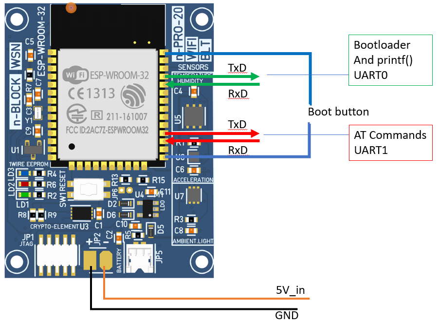

# ModemESP32

Testing ESP32 WROOM32D WIFI modem and AT-Comands with [n-PRO-20](http://www.n-blocks.net/nmodules/doku.php?id=nblocks:n-pro-20)


----



----


## Testing with Arduino IDE
Bootloader Uart workded seamlessly with Arduino IDE 'Upload' :heavy_check_mark:


## Uploading new Factory image
After more than 90 minutes, still did not flash it :x:


## Testing with the existing Factory image
 *  Ater connecting to UART0 the Modem respondes to AT commands :heavy_check_mark:
 *  Connects to the domestic WiFi Access Point :heavy_check_mark:
 *  Connects to a remote Server :heavy_check_mark:
 *  ...
 *  ...

### Tested AT commands
```
AT+GMR
AT+CWMODE=1
AT+CWMODE?
AT+CWLAP
AT+CWJAP="ssid","password"

AT+CIPSTART="TCP","fernandocosentino.net",80
AT+CIPSEND=57

GET /hello.html HTTP/1.1
Host: fernandocosentino.net


AT+CIPCLOSE
```


## Links
[Hardware Connection](https://docs.espressif.com/projects/esp-at/en/latest/Get_Started/Hardware_connection.html)