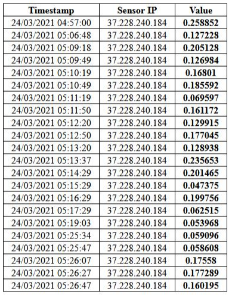
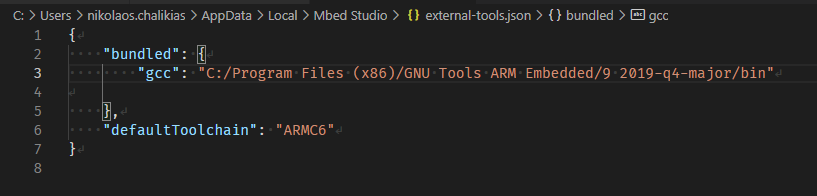
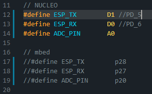

# [39_ModemESP32_test](https://github.com/The-101-project/39_ModemESP32_test)

Testing ESP32 WROOM32D WIFI modem and AT-Comands with [n-PRO-20](http://www.n-blocks.net/nmodules/doku.php?id=nblocks:n-pro-20)


----


----

<!-- pagebreak -->


## Testing with Arduino IDE
Bootloader Uart workded seamlessly with Arduino IDE 'Upload' :heavy_check_mark:


## Uploading new Factory image
After more than 90 minutes, still did not flash it :x:


## Testing with the existing Factory image
 *  Ater connecting to UART0 the Modem respondes to AT commands :heavy_check_mark:
 *  Connects to the domestic WiFi Access Point :heavy_check_mark:
 *  Connects to a remote Server :heavy_check_mark:
 *  ...
 *  ...

## Manually Tested AT commands with a Terminal
```
AT+GMR
AT+CWMODE=1
AT+CWMODE?
AT+CWLAP
AT+CWJAP="ssid","password"

AT+CIPSTART="TCP","n-blocks.net",80
AT+CIPSEND=76

GET /sensor_test/receive.php?value=1234 HTTP/1.1
Host: www.n-blocks.net


AT+CIPCLOSE
```

<!-- pagebreak -->

## Test sending data to URL

Using the preprogrammed factory flash image: 
 *  Connect an mbed board with this repository firmware, to ESP32 based [n-PRO-20](http://www.n-blocks.net/nmodules/doku.php?id=nblocks:n-pro-20)

 *  to monitor the data, use: `http://www.n-blocks.net/sensor_test/`



To erase all the data, add `receive.php?value=clear` at the end of the url above.  
**Attention**
 Please be carefull: There is no confirmation, no questions asked.  
 You visit the url--> data is gone


----


## Compile with GCC

mbed-studio [Switching to GCC](https://os.mbed.com/docs/mbed-studio/current/installing/switching-to-gcc.html)



## Compile for Nucleo L476RG

----
While a previous compilation for Nucleo F103 was using pins PD_5, PD_6, compiling with newer version of mbed-studio, first failed with ARMC6 compiler and then after switchning to ARM_GCC failed again. Changing to pins D1, D0 allowed compilation without errors. **To Be tested** with ESP32 connected.



----


## Links
[Hardware Connection](https://docs.espressif.com/projects/esp-at/en/latest/Get_Started/Hardware_connection.html)